CUDA Rasterizer
===============

**University of Pennsylvania, CIS 565: GPU Programming and Architecture, Project 4**

* Name: Meghana Seshadri
* Tested on: Windows 10, i7-4870HQ @ 2.50GHz 16GB, GeForce GT 750M 2048MB (personal computer)


## Project Overview

The goal of this project was to get an introduction to writing a GPU Rasterizer in CUDA. The pipeline being used is similar to that of OpenGL, where the following are implemented: vertex shading, primitive assembly, rasterization, fragment shading, and a framebuffer. 


[Click here for instructions of this project](./INSTRUCTION.md)

### Features

The following features were implemented (most of which can be toggled with flags in `rasterize.cu`):

**Basic Rasterization Pipeline:**

* Vertex shading. (_vertexTransformAndAssembly in rasterize.cu)
* Primitive assembly with support for triangles read from buffers of index and vertex data (_primitiveAssembly in rasterize.cu)
* Rasterization (_rasterize in rasterize.cu)
* Fragment shading (render in rasterize.cu)
* A depth buffer for storing and depth testing fragments (int * dev_depth in rasterize.cu)
* Fragment-to-depth-buffer writing (with atomics for race avoidance)
* Lambertian lighting scheme in the Fragment shader (render in rasterize.cu)


**Extra Features:**

* UV texture mapping with bilinear texture filtering and perspective correct texture coordinates
* Support for rasterizing the following primitives:
	- Points
	- Lines
	- Triangles


### Running the code
The main function requires a glTF model file (can be found in `/gltfs`). Call the program with one as an argument: `cis565_rasterizer gltfs/duck/duck.gltf`. (In Visual Studio, `../gltfs/duck/duck.gltf`.)

If you are using Visual Studio, you can set this in the `Debugging > Command Arguments` section in the Project properties. 


### Rasterization Pipeline

#### Vertex Shading
* VertexIn[n] vs_input -> VertexOut[n] vs_output
* Apply some vertex transformation (e.g. model-view-projection matrix using glm::lookAt and glm::perspective).

#### Primitive assembly
* VertexOut[n] vs_output -> Triangle[t] primitives

#### Rasterization
* Triangle[t] primitives -> Fragment[m] rasterized
* Parallelize over triangles, but now avoid looping over all pixels:
	- When rasterizing a triangle, only scan over the box around the triangle (getAABBForTriangle).

#### Fragments to depth buffer 
* Fragment[m] rasterized -> Fragment[width][height] depthbuffer
* depthbuffer is for storing and depth testing fragments.

**Depth Buffer Testing**

Each pixel can contain multiple fragments, each at different z-depth values. In a rasterizer, one must only render the fragment with the minimum depth (aka the front most fragment). The nearest fragments per pixel are then stored in a depth buffer. Every run of the rasterization will constantly find the nearest fragment and update the depth buffer accordingly. 

This process can be done before fragment shading, which prevents the fragment shader from changing the depth of a fragment. In order to do this safely on the GPU, however, race conditions must be avoided. Race conditions can occur ince multiple primitives in a scene are writing their fragment to the same place in the depth buffer. In order to handle this, there are two approaches:

* `Approach 1:` Convert your depth value to a fixed-point int, and use atomicMin to store it into an int-typed depth buffer intdepth. After that, the value which is stored at intdepth[i] is (usually) that of the fragment which should be stored into the fragment depth buffer.
	- This may result in some rare race conditions (e.g. across blocks).

* `Approach 2:` (The safer approach) Lock the location in the depth buffer during the time that a thread is comparing old and new fragment depths (and possibly writing a new fragment). This should work in all cases, but be slower. This method involves using CUDA mutexes to test only the fragments within a pixel serially. 

Approach 2 is the safer of the two approaches. By allocating a device int array (set to all 0's initially), we can use this to store all the minimum depth values per pixel. The dimensions of this 1D array would be width * height to correspond with the screen. In the resources section, you can see a pseudocode breakdown of how this mutex is used. 

#### Fragment shading
* Fragment[width][height] depthbuffer ->
* Add a shading method, such as Lambert or Blinn-Phong. Lights can be defined by kernel parameters (like GLSL uniforms).

#### Fragment to framebuffer writing
* -> vec3[width][height] framebuffer
* Simply copies the colors out of the depth buffer into the framebuffer (to be displayed on the screen).


## Renders

### Texture Mapping 
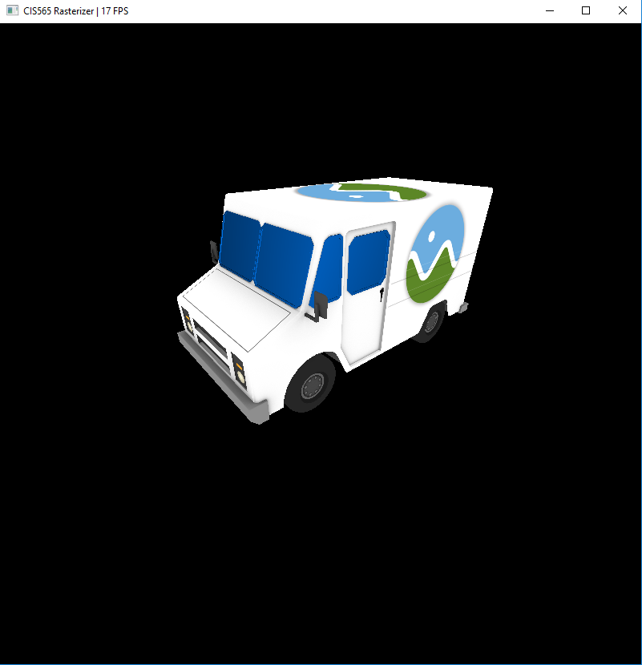
###### (Cesium Milk Truck)

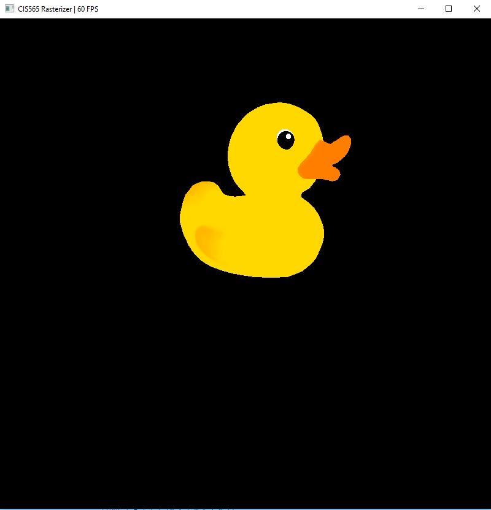
###### (Duck)

### Rendering with points
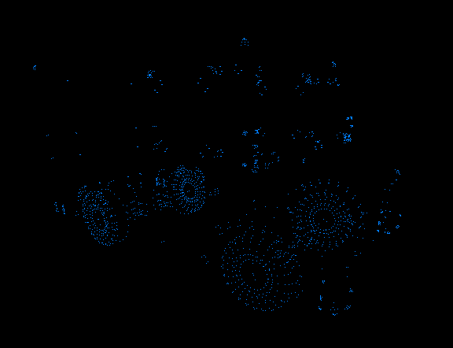

### Rendering with lines
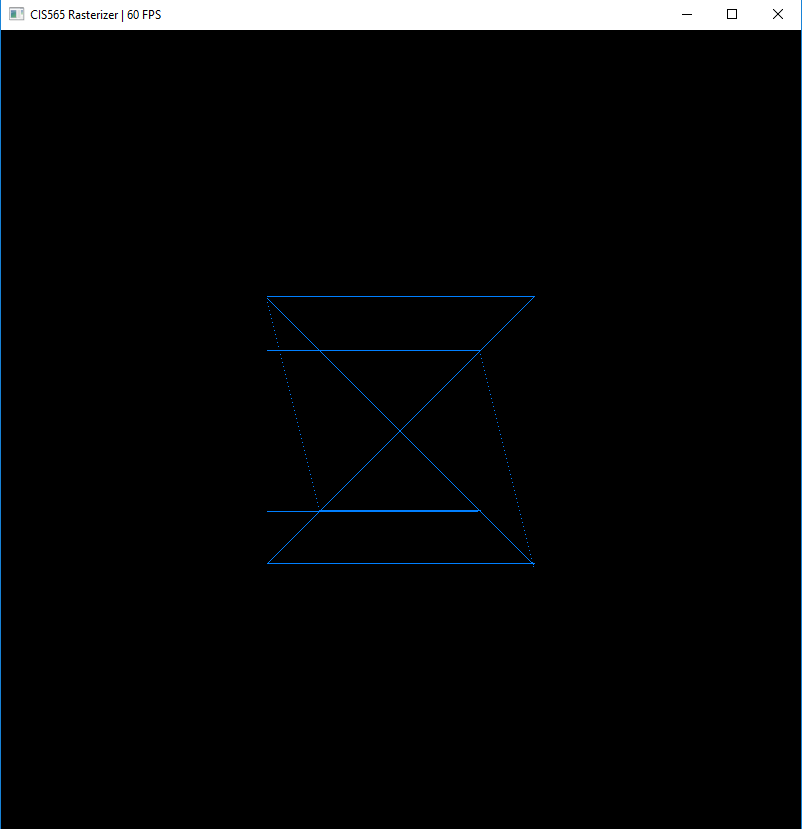

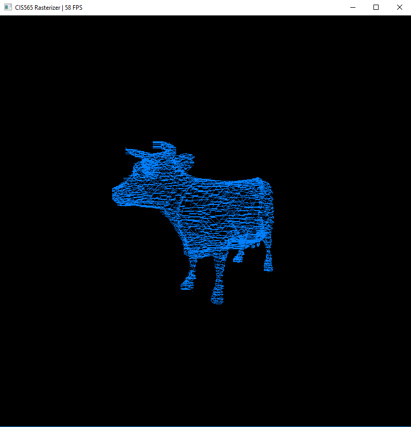

### Depth Buffer Test
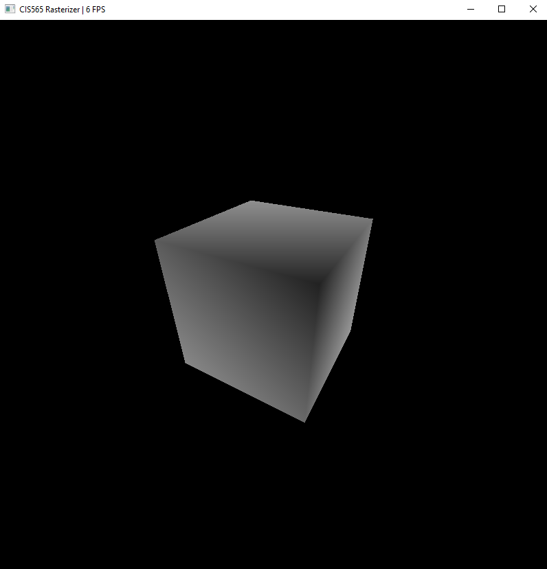

### Normal Test
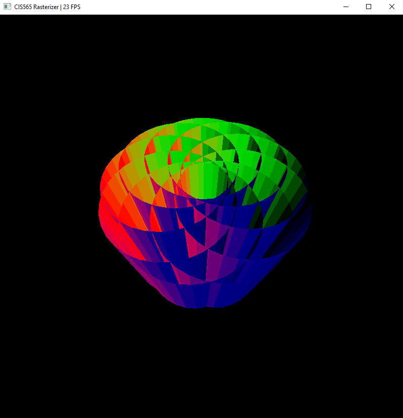


## Performance Analysis

The following tests were all to compare the different steps of the rasterization pipeline and were done by taking an average of times over 10 iterations of each step.


### Performance Across Pipeline
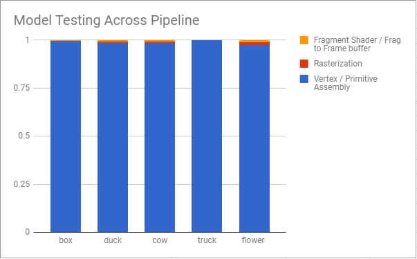

According to the chart, the vertex and primitive assembly is clearly the stage that takes up the most time, as compared to the rasterization step and fragment shader, no matter what poly count of the model. Why is this the case? The vertex assembly is completing a series of incoherent memory allocations to and from global memory for each primitive by allocating vertices for each triangle, and other attribute data such as positions, normals, texture data, and transformations. 


### Feature Analysis 

#### UV texture Mapping with bilinear texture filtering and perspective correct texture coordinates


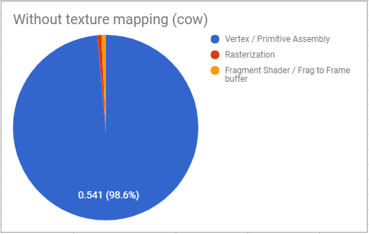

Regardless of texturing or not, the vertex shading and primitive assembly stage of the rasterization pipeline takes up the most time as compared to the other stages.


#### Support for rasterizing points, lines, and triangles

**Points**


Regardless of rendering points with high poly count models or low poly count models, the vertex shading and primitive assembly stage of the rasterization pipeline takes up the most time as compared to the other stages.


**Lines**


Regardless of rendering lines with high poly count models or low poly count models, the vertex shading and primitive assembly stage of the rasterization pipeline takes up the most time as compared to the other stages.


### Mutex Test
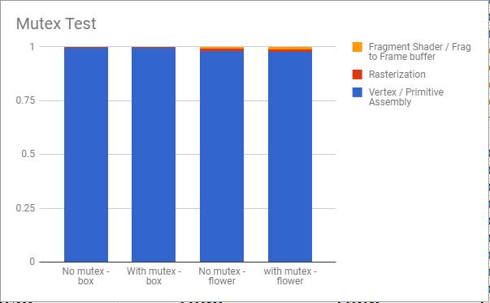

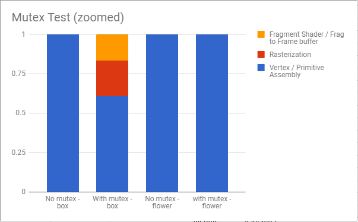

Regardless of rendering with the mutex utilized for depth buffer testing, the vertex shading and primitive assembly stage of the rasterization pipeline takes up the most time as compared to the other stages. What's interesting to note here is that, the box takes a lot longer to render than the flower, regardless of with the mutex or not, and regardless of whether you zoom into the model or not.

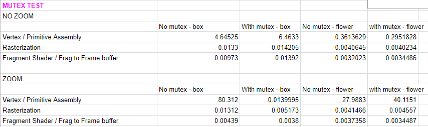

This probably occurs because the box is such a low poly count model, hence, the overhead in setting up the device arrays and completing the various kernels for the rasterization pipeline is higher.

#### Note

Something that I noticed was that as I zoomed in to the object in the window, then the program would run much more slowly and sometimes even freeze. I believe this may be occurring because the rasterizer is trying to access triangles that have some vertices that are not visible in the window. Hence, the loop through a triangle's bounding box would take much longer because it's trying to access triangle vertices that don't exist on the screen. The optimization/fix here would probably be to clamp the min and max coordinates of the bounding box to be within the screen width and height.

## Resources 

### CUDA Mutexes

CUDA mutexes were used for depth buffer testing.

Adapted from
[this StackOverflow question](http://stackoverflow.com/questions/21341495/cuda-mutex-and-atomiccas).

```cpp
__global__ void kernelFunction(...) {
    // Get a pointer to the mutex, which should be 0 right now.
    unsigned int *mutex = ...;

    // Loop-wait until this thread is able to execute its critical section.
    bool isSet;
    do {
        isSet = (atomicCAS(mutex, 0, 1) == 0);
        if (isSet) {
            // Critical section goes here.
            // The critical section MUST be inside the wait loop;
            // if it is afterward, a deadlock will occur.
        }
        if (isSet) {
            mutex = 0;
        }
    } while (!isSet);
}
```

### Credits and other links

* [tinygltfloader](https://github.com/syoyo/tinygltfloader) by [@soyoyo](https://github.com/syoyo)
* [glTF Sample Models](https://github.com/KhronosGroup/glTF/blob/master/sampleModels/README.md)

**Texture Mapping**
* [Getting color from UV coordinates](https://stackoverflow.com/questions/35005603/get-color-of-the-texture-at-uv-coordinate)
* [Bilinear filtering 1](https://en.wikipedia.org/wiki/Bilinear_filtering)
* [Bilinear filtering 2](https://www.scratchapixel.com/lessons/mathematics-physics-for-computer-graphics/interpolation/bilinear-filtering)
* [Perspective Correct Interpolation](https://www.scratchapixel.com/lessons/3d-basic-rendering/rasterization-practical-implementation/perspective-correct-interpolation-vertex-attributes)

**Bresenham Line Rendering**
* [Lecture slides 1](http://groups.csail.mit.edu/graphics/classes/6.837/F02/lectures/6.837-7_Line.pdf)
* [Lecture slides 2](https://www.cs.helsinki.fi/group/goa/mallinnus/lines/bresenh.html)